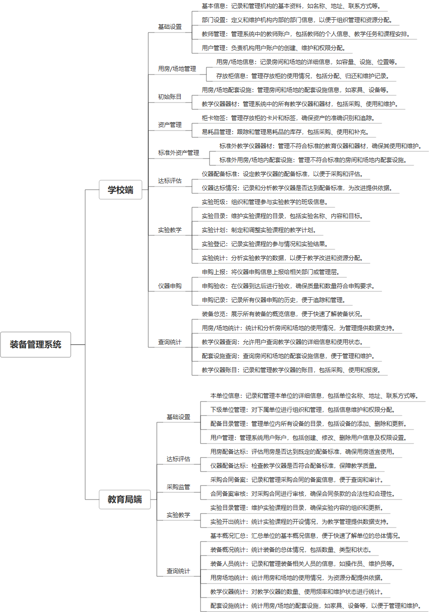

 

    
 

公司拥有上百套具有自主知识产权的软件系统，详情请查看码云首页或公司官网

 
<h1>装备管理系统</h1>

<a href="https://www.haishi.net.cn/">公司官网</a> ｜ <a href="https://www.haishi.net.cn/">在线体验</a>

 

## 系统介绍

教育装备管理系统是一款专为学校设计的综合管理平台，旨在高效管理和优化教育装备的使用与配置。系统涵盖了基础设置、资产管理、采购管理、实验教学和查询统计等核心模块，实现对基本信息、部门设置、教师管理、用户权限设置等基础数据的全面管理，同时支持仪器配备标准、用房场地管理及配套设施的达标评估。用户可以通过系统进行采购计划的设立、申购数据的审核与上报、合同备案及监管，有效提升装备采购的透明度与效率。实验教学模块提供实验班级、实验计划与实验目录的全流程管理，并结合实验监控与统计功能，确保教学活动的顺利开展。该系统还提供多维度数据统计与分析，如装备概况、用房配备、人员配置等，为教育装备的科学配置与管理决策提供有力支持。
教育装备管理系统是一款专为学校设计的综合管理平台，旨在高效管理和优化教育装备的使用与配置。系统涵盖了基础设置、资产管理、采购管理、实验教学和查询统计等核心模块，实现对基本信息、部门设置、教师管理、用户权限设置等基础数据的全面管理，同时支持仪器配备标准、用房场地管理及配套设施的达标评估。用户可以通过系统进行采购计划的设立、申购数据的审核与上报、合同备案及监管，有效提升装备采购的透明度与效率。实验教学模块提供实验班级、实验计划与实验目录的全流程管理，并结合实验监控与统计功能，确保教学活动的顺利开展。该系统还提供多维度数据统计与分析，如装备概况、用房配备、人员配置等，为教育装备的科学配置与管理决策提供有力支持。
本系统主要针对教育局、学校两端，实现教育局对下级学校装备配备情况的监管，学校对本校装备进行管理。系统功能涵盖装备配备、实验教学、达标评估、采购监督、查询统计等方面。
                

## 系统功能介绍

### 系统包含终端说明

管理端（WEB）

| 序号 | 模块 | 模块说明 |
| --- | --- | --- |
| 1 | JY-EES-JYZB-SERVER | 服务端 |

### 系统功能结构

### 系统功能说明

**教育局端**
- 基础设置：本单位信息、下级单位管理、配备目录管理、用户管理
- 达标评估：用房配备达标、仪器配备达标
- 采购监督：采购合同备案、采购监管、合同备案审核
- 实验教学：实验目录管理、实验开出统计
- 查询统计：基本概况汇总、装备概况统计、装备人员统计、用房场地统计、教学仪器统计、配套设置统计
**学校端**
- 基础设置：基本信息、部门设置、教师管理、用户管理
- 用房/场地管理：用房/场地信息、存放柜信息
- 初始账目：用房/场地配套设施、教学仪器器材
- 资产管理：教学仪器器材、用房/场地内配套设施、柜卡物签、易耗品管理
- 标准外资产管理：标准外教学仪器器材、标准外用房/场地内配套设施
- 达标评估：仪器配备标准、仪器达标情况
- 实验教学：实验班级、实验目录、实验计划、实验登记、实验统计
- 仪器申购：仪器申购、申购上报、申购验收、申购记录
- 查询统计：装备总览、用房/场地统计、教学仪器查询、配套设施查询、教学仪器账目

## 系统主要界面

## 系统技术说明

### 代码模块说明

| 序号 | 目录 | 目录说明 |
| --- | --- | --- |
| 1 | JY-EES-JYZB-SERVER/.idea | -- |
| 2 | JY-EES-JYZB-SERVER/src | -- |

### 系统技术选型

#### 开发语言/框架

JAVA（JDK1.8）
前端框架：layui
框架：Jfinal
系统结构：单体应用

#### 服务中间件

Tomcat
其他
Nginx

#### 数据库

MySQL（5.7+）
Redis

#### 其他说明

无

## 系统演示/商用

请扫码添加客服微信获取演示地址和系统详细资料。

如果您想基于装备管理系统进行商业化交付或定制开发服务，我们提供有偿的技术服务支持，合作模式不限，欢迎沟通！

公司官网地址： <a href="https://www.haishi.net.cn/">https://www.haishi.net.cn</a>

联系客服获取专业回答。

## 使用须知

1、 本项目商用必须获得版权所有者的授权。

2、 未经允许本项目代码不允许二次出售。

